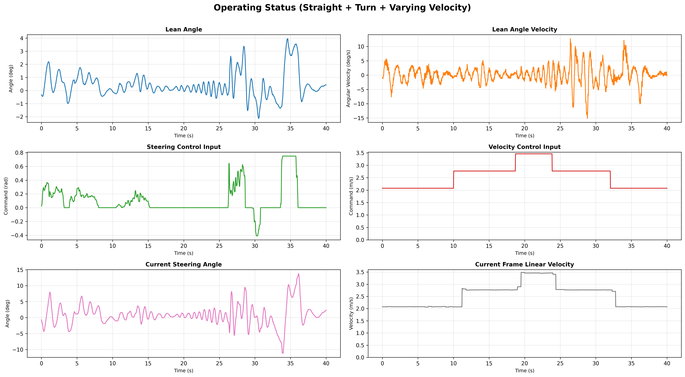
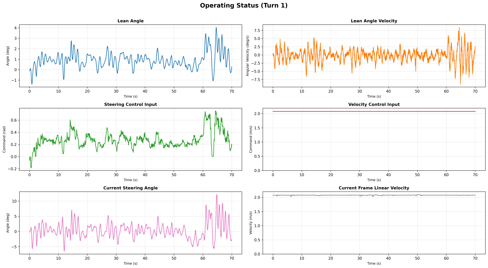
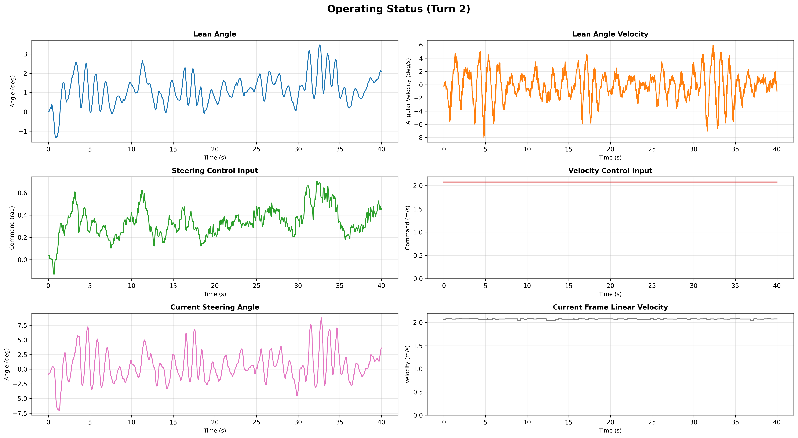
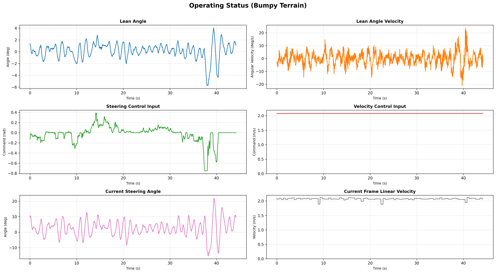
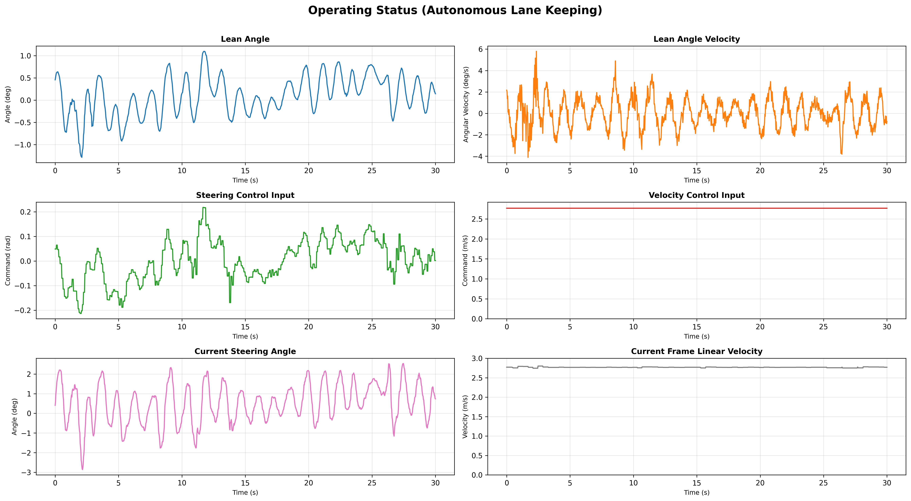

# CycleRL Configurations

## **1 Physical Parameters and Hyperparameters of the Simulation Environment (Isaac Sim)**  

| Parameter Category                                           |        Symbol        | Value/Range                 |
| :----------------------------------------------------------- | :------------------: | :-------------------------- |
| **_Inertial Properties (from USD)_**                         |                      |                             |
| Frame Mass                                                   |     $m_{frame}$      | 15.8 kg                     |
| Handlebar Mass                                               |     $m_{handle}$     | 1.9 kg                      |
| Front / Rear Wheel Mass                                      |     $m_{wheel}$      | 2.5 kg / 4.5 kg             |
| Frame Inertia ($I_{xx_{fr}}, I_{yy_{fr}}, I_{zz_{fr}}$)      |     $I_{frame}$      | [0.761, 0.832, 1.561] kg·m² |
| Handlebar Inertia ($I_{xx_{h}}, I_{yy_{h}}, I_{zz_{h}}$)     |   $I_{handlebar}$    | [0.022, 0.013, 0.021] kg·m² |
| Front Wheel Inertia ($I_{xx_{fw}}, I_{yy_{fw}}, I_{zz_{fw}}$) |     $I_{front}$      | [0.112, 0.112, 0.223] kg·m² |
| Rear Wheel Inertia ($I_{xx_{rw}}, I_{yy_{rw}}, I_{zz_{rw}}$) |      $I_{rear}$      | [0.201, 0.201, 0.401] kg·m² |
| Center of Gravity Height                                     |      $h_{CoG}$       | 0.65 m                      |
| **_Geometric Kinematics_**                                   |                      |                             |
| Wheelbase                                                    |         $L$          | 1.1 m                       |
| Wheel Diameter                                               |     $d_{wheel}$      | 0.66 m                      |
| Steering Axis Tilt (Caster Angle)                            |       $\alpha$       | 20.0°                       |
| Mechanical Trail                                             |     $t_{trail}$      | 0.11 m                      |
| Fork Offset                                                  |     $l_{offset}$     | 0.01 m                      |
| Max Steering Angle                                           |    $\delta_{max}$    | $\pm 45$°                   |
| **_Actuator Dynamics_**                                      |                      |                             |
| Steering Motor Max Torque                                    | $\tau_{steer}^{max}$ | 23.7 N·m                    |
| Steering Joint Stiffness                                     |     $p_{steer}$      | 3.0 N·m/rad                 |
| Steering Joint Damping                                       |     $d_{steer}$      | 0.15 N·m·s/rad              |
| Drive Motor Max Torque                                       | $\tau_{drive}^{max}$ | 45.0 N·m                    |
| Physics Simulation Step                                      |      $dt_{sim}$      | 0.02 s (50 Hz)              |
| **_Contact & Surface Interaction_**                          |                      |                             |
| Surface Friction Coefficient                                 |        $\mu$         | $\mathcal{U}(0.5, 1.5)$     |
| Restitution (Bounciness)                                     |         $e$          | 0.0                         |
| Contact Stiffness                                            |    $k_{contact}$     | $10^4$ N/m                  |
| **_Simulation Hyperparameters_**                             |                      |                             |
| Parallel Environments                                        |      $N_{env}$       | 16,384                      |
| Control Frequency                                            |      $f_{ctrl}$      | 50 Hz                       |
| Episode Duration                                             |       $T_{ep}$       | 64 s (3,200 steps)          |
| Total Training Epochs                                        |     $N_{epoch}$      | 5,000                       |

> *Note: Inertial values are estimated from the USD model. Friction coefficients are randomized during training as part of the domain randomization strategy.*

## **2 Training Configurations**

| Hyperparameters                  | Value                                |
| -------------------------------- | ------------------------------------ |
| **_PPO Hyperparameters_**        |                                      |
| Learning rate                    | $1\times 10^{-4}$ (cosine annealing) |
| Discount factor γ                | 0.99                                 |
| GAE parameter λ                  | 0.95                                 |
| Policy clip ratio ε              | 0.2                                  |
| Value function coefficient       | 1.0                                  |
| **_Network Architecture_**       |                                      |
| Actor network                    | 5-layer MLP [512, 256, 128, 64]      |
| Critic network                   | 5-layer MLP [512, 256, 128, 64]      |
| Activation function              | ELU                                  |
| **_Simulation Hyperparameters_** |                                      |
| Parallel environments            | 4,096                                |
| Simulation frequency             | 50 Hz                                |
| Episode duration                 | 64 seconds (3,200 steps)             |
| Total training epochs            | 5,000                                |

> Note: MLP includes input-to-hidden and hidden-to-output transformations for 8-dimensional input and 2-dimensional output.

## **3 Specifications of Hardware Platform**

| Component                 | Specification                   |
| ------------------------- | ------------------------------- |
| **Mechanical Platform**   |                                 |
| Base vehicle              | Modified Mountain Bike          |
| Wheelbase                 | 1,100 mm                        |
| Total mass                | 25.0 kg (including electronics) |
| Center of gravity height  | 0.65 m                          |
| Wheel diameter            | 0.66 m                          |
|Steering Axis Tilt         | 20.0°                           |
| **Computational System**  |                                 |
| Main processor            | NVIDIA Jetson Orin NX           |
| Memory                    | 16 GB LPDDR5                    |
| Storage                   | 512 GB NVMe SSD                 |
| Operating system          | Ubuntu 20.04                    |
| **Sensing and Actuation** |                                 |
| IMU                       | WheelTec N100                   |
| Steering servo motor      | Unitree GO-M8010-6              |
| Hub motor                 | BaFang RM G020.500.D 12         |
| Power system              | 48V 9.6Ah lithium battery       |

## **4 Implementation Details of Baseline Controllers**

**A. Linear Quadratic Regulator (LQR)**

**(1) Modeling and Linearization**

The LQR baseline is founded on the linearized dynamics of a bicycle modeled as an inverted pendulum. The state-space equation is defined as $\dot{x} = A(v)x + B(v)u$, where the state vector $x = [\phi, \dot{\phi}, \delta]^T$ consists of the roll angle, roll rate, and steering angle, and the control input $u = \dot{\delta}$ represents the steering rate command.

The system matrices derived from the linearized equations of motion at a velocity $v$ are: A(v) = [[0, 1, 0], [g/h, 0, -v^2/(hL)], [0, 0, 0]], B(v) = [0, -v/L, 1]^T, where $g$ is gravity, $h$ is the center of mass height, and $L$ is the wheelbase.

**(2) Gain Scheduling and Tracking**

Since the system dynamics $A(v)$ and $B(v)$ are velocity-dependent, a single gain matrix $K$ cannot stabilize the vehicle across the entire operating range. We employed a **gain scheduling** strategy:
a)  **Real-time Gain Computation**: For each control step, the optimal gain matrix $K(v)$ is computed on-the-fly by solving the continuous-time Algebraic Riccati Equation using the current velocity $v$. This avoids the need for offline lookup tables and ensures exact gain matching at any speed.
c)  **Reference Tracking:** To track a target steering angle $\delta_{cmd}$, we calculate a physics-based reference state $x_{ref} = [\phi_{ref}, 0, \delta_{cmd}]^T$, where the equilibrium roll angle is given by $\phi_{ref} \approx \frac{v^2}{gL}\delta_{cmd}$. The control law is: $u = -K(v)(x - x_{ref})$

**(3) Parameter Tuning**

The cost function weights were tuned to prioritize upright stability. The state weighting matrix $Q$ and control weighting $R$ were set as follows:
*   $Q = \text{diag}[20.0, 6.0, 3.5]$: High penalty on roll angle ($\phi$) to ensure balance, moderate penalty on steering angle ($\delta$).
*   $R = 1.5$: Penalizes aggressive control action

**B. Cascaded PID Controller**

**(1) Control Architecture**

The PID baseline adopts a **dual-loop cascaded architecture** to handle the underactuated nature of the bicycle:
*   **Outer Loop (Trajectory):** Maps the user's steering command $\delta_{cmd}$ to a required roll angle $\phi_{ref}$ necessary to sustain the turn without falling (balancing centrifugal force).

    $\phi_{ref} = \text{clip}\left( \frac{v^2}{gL}\delta_{cmd}, -\phi_{max}, \phi_{max} \right)$
    
*   **Inner Loop (Balance):** A PD controller that calculates the steering action to track the reference roll angle.

    $\delta_{out} = K_p(v)(\phi - \phi_{ref}) + K_d(v)\dot{\phi}$

**(2) Velocity-Dependent Gain Scaling**

To address the changing sensitivity of the vehicle's response to steering inputs at different speeds, the PID gains are scaled inversely with the square of the velocity: $K_p(v) = K_{p,base} \cdot \left(\frac{v_{ref}}{v}\right)^2, \quad K_d(v) = K_{d,base} \cdot \left(\frac{v_{ref}}{v}\right)^2$
This scaling ensures that at low speeds (where steering has less effect on roll), the gains are increased, and at high speeds, they are dampened to prevent oscillation.

**(3) Tuning Process**

The base parameters ($K_{p,base}, K_{d,base}$) were tuned at a reference velocity $v_{ref}=2.0$ m/s using the Ziegler-Nichols heuristic:  
1.  $K_d$ was set to 0, and $K_p$ was increased until the system exhibited sustained oscillation around the upright position.  
2.  $K_d$ was then introduced to provide damping and eliminate overshoot.  
3.  The velocity scaling factor was clipped to the range $[0.2, 5.0]$ to prevent instability at extreme speeds.

The final base gains were set to $K_{p,base} = 4.0$ and $K_{d,base} = 0.4$, which provided stable balance without excessive oscillation at $v_{ref} = 2.0$ m/s.

## **5 Command and State Profiles**

  

  

  

  

  

